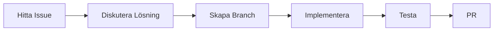

# 🤝 Bidra till Cursor+Loveable Toolkit

<div align="center">

### 🎯 **Vision**
Hjälp utvecklare eliminera JSX-kompatibilitetsproblem mellan Cursor och Loveable.dev genom kostnadseffektiv automation.

[](CODE_OF_CONDUCT.md)
[](http://makeapullrequest.com)
[](http://www.firsttimersonly.com/)

</div>

## 🚀 **Snabbstart för Contributors**

### 1️⃣ **Förbered din utvecklingsmiljö**

```bash
# Klona och installera
git clone https://github.com/MADPee/cursor-loveable-toolkit.git
cd cursor-loveable-toolkit
npm install

# Aktivera development tools (valfritt i målprojekt efter installation)
# Kommandon kan skilja sig per målprojekt

# Öppna i VS Code med rekommenderade extensions
code .
```

### 2️⃣ **Välj ett bidragsområde**

<table>
<tr>
<td width="25%">

#### 🐛 Bug Fixes
- [Öppna issues](https://github.com/MADPee/cursor-loveable-toolkit/issues?q=is:issue+is:open+label:bug)
- [Good first issues](https://github.com/MADPee/cursor-loveable-toolkit/issues?q=is:issue+is:open+label:"good+first+issue")
- [Help wanted](https://github.com/MADPee/cursor-loveable-toolkit/issues?q=is:issue+is:open+label:"help+wanted")

</td>
<td width="25%">

#### 💡 Features
- [Feature requests](https://github.com/MADPee/cursor-loveable-toolkit/issues?q=is:issue+is:open+label:enhancement)
- [Discussions](https://github.com/MADPee/cursor-loveable-toolkit/discussions/categories/ideas)
- Roadmap (kommer)

</td>
<td width="25%">

#### 📖 Documentation
- [Documentation issues](https://github.com/MADPee/cursor-loveable-toolkit/issues?q=is:issue+is:open+label:documentation)
- [Examples needed](https://github.com/MADPee/cursor-loveable-toolkit/issues?q=is:issue+is:open+label:"examples+needed")
- [Translations](https://github.com/MADPee/cursor-loveable-toolkit/issues?q=is:issue+is:open+label:translations)

</td>
<td width="25%">

#### 🔧 Optimization
- [Performance issues](https://github.com/MADPee/cursor-loveable-toolkit/issues?q=is:issue+is:open+label:performance)
- [Cost optimization](https://github.com/MADPee/cursor-loveable-toolkit/issues?q=is:issue+is:open+label:"cost+optimization")
- [Technical debt](https://github.com/MADPee/cursor-loveable-toolkit/issues?q=is:issue+is:open+label:"technical+debt")

</td>
</tr>
</table>

## 💻 **Development Workflow**

### **1. Planera dina ändringar**



1. 🔍 **Hitta eller skapa ett issue**
   - Använd issue templates
   - Tagga med relevanta labels
   - Diskutera implementation

2. 🌿 **Skapa feature branch**
   ```bash
   git checkout -b feature/amazing-improvement
   ```

3. 💡 **Implementera din lösning**
   - Följ kodstil (ESLint)
   - Lägg till tester
   - Dokumentera ändringar

### **2. Kvalitetssäkring**

```bash
# Validera ändringar (i toolkitens egen kod)
npm run validate-smart
```

#### **Checklista före PR:**
- [ ] Alla tester passerar
- [ ] Dokumentation uppdaterad
- [ ] Changelog uppdaterad
- [ ] Inga regression bugs
- [ ] Prestanda verifierad

### **3. Submit Pull Request**

1. 📝 **Förbered PR**
   ```bash
   # Uppdatera din branch
   git fetch origin main
   git rebase origin/main
   
   # Push ändringar
   git push origin feature/amazing-improvement
   ```

2. 📋 **PR Template**
   - Tydlig titel
   - Länka till issue
   - Beskriv ändringar
   - Lista testresultat

3. 👀 **Review Process**
   - Svara på feedback
   - Uppdatera kod
   - Verifiera ändringar

## 🎯 **Contribution Guidelines**

### **Kod Standards**

```typescript
// ✅ Bra exempel
export function validateJSX(code: string): ValidationResult {
  try {
    // Tydlig error handling
    const result = await validate(code);
    logger.debug('Validation complete', { result });
    return result;
  } catch (error) {
    logger.error('Validation failed', { error });
    throw new ValidationError(error);
  }
}

// ❌ Undvik
export function validate(c) {
  try {
    return doValidation(c);
  } catch(e) {
    console.log(e);
  }
}
```

### **Testing Standards**

```typescript
// ✅ Bra test exempel
describe('JSX Validator', () => {
  it('should handle complex components', async () => {
    const input = loadFixture('ComplexComponent.tsx');
    const result = await validateJSX(input);
    expect(result.isValid).toBe(true);
    expect(result.errors).toHaveLength(0);
  });
});
```

### **Documentation Standards**

```typescript
/**
 * Validerar JSX kod med intelligent error detection
 * @param code - JSX/TSX kod att validera
 * @returns ValidationResult med detaljerad feedback
 * @throws ValidationError om kritiska fel upptäcks
 * @example
 * ```typescript
 * const result = await validateJSX(code);
 * if (result.isValid) {
 *   // Fortsätt med build
 * }
 * ```
 */
```

## 🏆 **Recognition & Rewards**

- 🌟 Featured i README
- 📢 Erkännande i releases
- 👕 Swag för större bidrag
- 💼 Direkt kontakt med team

## 📞 **Få Hjälp**

- 💬 [Discord Community](https://discord.gg/cursor-loveable)
- 📧 [Email Support](mailto:support@cursor-loveable.dev)
- 📖 [Contributing FAQ](docs/CONTRIBUTING_FAQ.md)

---

**💪 Tillsammans gör vi utveckling enklare och mer kostnadseffektiv!**

### 3. **Framework Support**
Help extend toolkit for:
- Vue.js projects
- Angular projects  
- React Native
- Next.js optimization
- Svelte compatibility

### 4. **Platform Support**
- Windows-specific improvements
- Linux optimizations
- Docker/container support
- CI/CD integrations

## 📋 Development Guidelines

### **Code Style**
- Use ES modules (import/export)
- Add comprehensive error handling
- Include JSDoc comments
- Follow existing naming conventions

### **Cost Optimization Priority**
- Local validation first, AI as last resort
- Batch processing when possible
- Clear cost implications in features
- Performance over features

### **Testing**
- Test on multiple project types
- Verify cross-platform compatibility
- Ensure zero false positives
- Document edge cases

## 🚀 Priority Areas

### **High Priority:**
1. **Reduce false positives** - Most important goal
2. **Cross-platform compatibility** - Windows/Linux improvements
3. **Framework support** - Vue.js, Angular, etc.
4. **Cost optimization** - Better AI usage patterns

### **Medium Priority:**
1. **Performance** - Faster validation, less resource usage
2. **Integration** - Better VS Code/IDE support
3. **Documentation** - More examples, tutorials
4. **Customization** - Project-specific configurations

### **Future Enhancements:**
1. **NPM package** - Easy `npm install` distribution
2. **Web dashboard** - Team monitoring and analytics
3. **AI improvements** - Better error detection/repair
4. **Enterprise features** - Team management, reporting

## 📖 Documentation Standards

- Include real-world examples
- Test all code snippets
- Cross-platform instructions
- Cost impact explanations
- Troubleshooting sections

## 🔄 Pull Request Process

1. **Fork** the repository
2. **Create** feature branch (`git checkout -b feature/amazing-feature`)
3. **Test** thoroughly on multiple project types
4. **Document** changes in CHANGELOG.md
5. **Submit** pull request with clear description

### PR Requirements:
- [ ] Tested on at least 2 different projects
- [ ] Documentation updated
- [ ] No increase in false positives
- [ ] Cross-platform compatibility maintained
- [ ] Cost impact documented

## 💰 Cost Impact Guidelines

Any changes that affect AI usage must:
- Document cost implications
- Provide opt-out mechanisms  
- Maintain local-first approach
- Include budget controls

## 🎖️ Recognition

Contributors will be:
- Listed in README.md
- Credited in release notes
- Mentioned in toolkit output (optional)

## 📞 Questions?

- 📧 Create GitHub issue for technical questions
- 💬 Discussions for feature ideas
- 🐛 Issues for bug reports

**Goal: Make Cursor+Loveable development seamless for everyone!** 🌟
